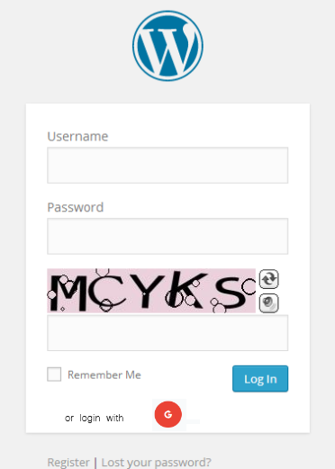

# login page documentation

Explaining the login page process.
#### Contents

- [Overview](#1-overview)
- [process](#2-process)
- [problem](#3-problem)

##  Overview

The login page allows users who have an account in this system to enter the system. The login page primarily consists of our website's logo, the username input box, the password input box, and the login button.

##  Login process
### 1. open the login page
 entering the URL "www.login.com".
### 2. input your user name and password
Enter your registered username and password. The field is case-sensitive and must be entered exactly. 
### 3. Complete CAPTCHA 
Enter the right CAPTCHA in the image to verify that you are not a robot. 
* If you can't see some Captcha clearly, click the refresh sign, a new Captcha will be generated and you can entered again. Captcha is valid for only 5 minutes and needs to be refreshed after expiration.
* If you can't see clearly, click the horn sign. By listening, type the letters you hear.

### 4. submit 
*  If you want the system to remember your login details for next visits, select the 'Remember Me' checkbox.
* click the sign in button. 
### 5. Login with Google
If you have a google account, you can have a quicker sign-in experience. 
* Click 'Google' icon .
* Select the Google account you want to use, or sign in a different one.
*  You may be asked to give permission for our page to access the basic information from your Google account. Review the permissions and, if you agree, proceed to authenticate.

After successful authentication, you will be logged in automatically.
## Problem

Here is a table that documents the  Error messages that may pop up during the login process 

| Error Scenario      | Error Message   | Suggested Action for user                                     |
| -----------|--------|-------------------------------------------------|
| Username field is empty |	"The username field cannot be blank."	| Please enter your username.
|Username does not exist	|"The username you entered does not exist."	| Check the username spelling or register for a new account.
|Password field is empty |	"The password field cannot be blank."	|Please enter your password.
|Password is incorrect	|"The password you entered is incorrect."	|Re-enter your password carefully
| CAPTCHA is incorrect	| "The CAPTCHA entered is incorrect. Try again." |	Enter the right CAPTCHA characters in the image .
|CAPTCHA has expired	|"The CAPTCHA has expired. Please try a new one." |	Refresh to get a new CAPTCHA and complete it.

Ensure that you're following the instructions given by the error message. If you continue to face difficulties, following tips can help you.
### 1. forget password
Click on the 'Lost your Password' link . Follow the instructions to reset your password, or you can view documents that forgot password.
### 2. unable to log in
* Restart your browser or change different browser  to see if this resolves the issue.
* If problems persist, contact website supportor.
### 3. don't have an accout
Click on the 'register' link . Follow the instructions to creat a new accout.